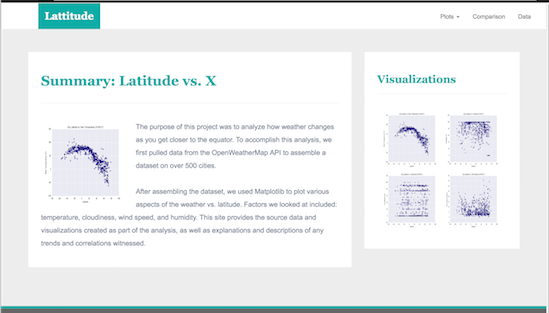

# Web Visualization
# Background:
Create a visualization dashboard website that has plots of weather data taken from api's.

## The website consists of 7 pages total, including:
  * A landing page containing:
    * An explanation of the project.
    * Links to each visualizations page.

  * Four visualization pages, each with:
    * A descriptive title and heading tag.
    * The plot/visualization itself for the selected comparison.
    * A paragraph describing the plot and its significance.
    
   * A "Comparisons" page that:
     * Contains all of the visualizations on the same page so we can easily visually compare them.
     * Uses a bootstrap grid for the visualizations.
     * The grid must be two visualizations across on screens medium and larger, and 1 across on extra-small and small screens.

    
    

## Directions 
Please view the website created for this project using data gathered from api source
The main website can be found at https://bvalmont.github.io/weatherdata/
Links can be found in the main landing page provided and will take you to any section of the web page.
